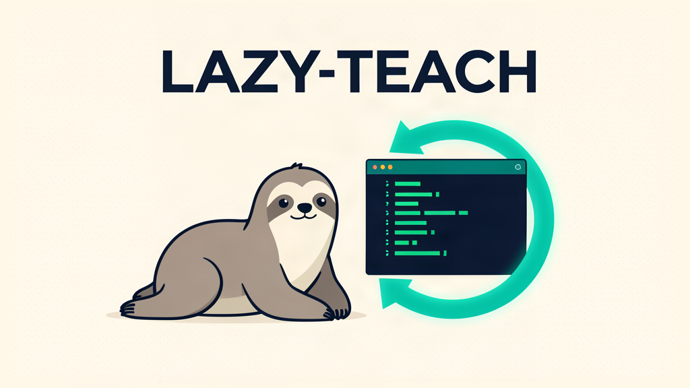
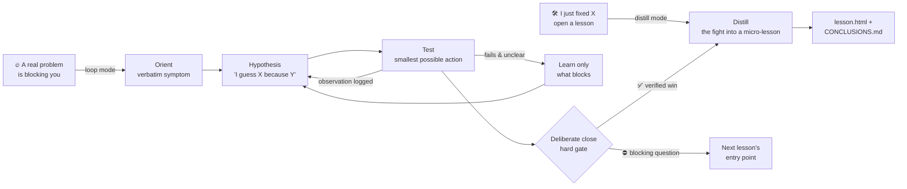
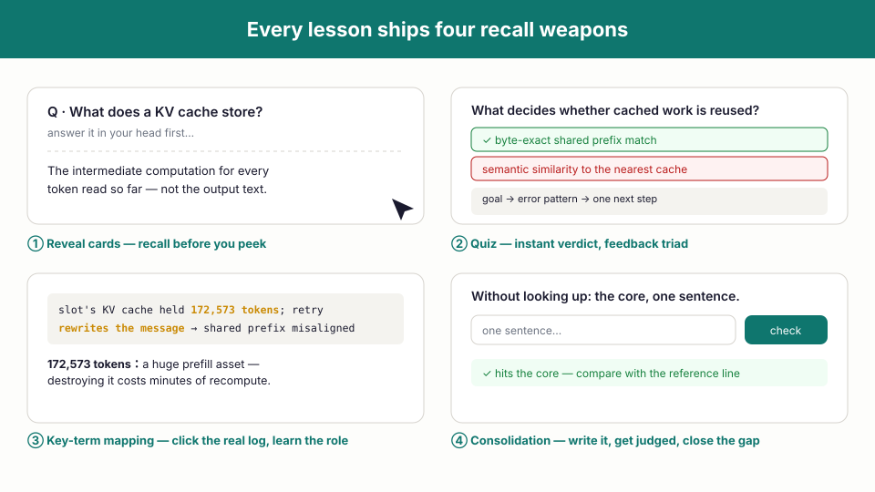

<div align="center">



# lazy-teach

**Learn from real problems, at the moment they block you. Not before.**

A skill for [Hermes Agent](https://hermes-agent.nousresearch.com/docs) that turns any bug, error message, or "why doesn't this work?!" into a 3-minute interactive micro-lesson — *after* it has already been defeated.

[](LICENSE)
[](https://hermes-agent.nousresearch.com/docs)
[]()
[]()

繁中介紹見下方 [中文簡介](#中文簡介)

</div>

---

## Why

Most learning dies in preparation. Courses first, practice later. Notes full of commands nobody ever runs again.

Real problems don't happen in chapters — they happen in chaos: incomplete information, noisy output, no one telling you what to try next. **Hacking is not about knowing more. It is about deciding faster.** The same is true of every technical craft.

`lazy-teach` deletes everything except the feedback loop:

> **Never learn something unless a real problem forces you to.**

It sits next to a full curriculum skill (`/teach`) and covers the opposite end: zero mission documents, zero roadmaps, zero upfront theory. One problem, one lesson, minutes not weeks.

## How it works

Two entry points, one rule:



**The hard gate**: every session ends with either ✅ **one win** (a specific, verified success) or ⛔ **one blocking question** (written down, becomes tomorrow's entry point). Random stops and rage-quits do not exist. There is always an escape hatch — but skipping leaves a trace.

## Every micro-lesson ships four recall weapons

Recognition feels like mastery. Recall *is* mastery. Every generated `lesson.html` is a single self-contained file (no dependencies, print-friendly) with:

<div align="center">

</div>

1. **Reveal cards** — answer in your head first, click to check
2. **Quiz with instant verdict** — equal-length options so formatting never leaks the answer; feedback follows the triad: goal → error pattern → one next step
3. **Key-term mapping** — clickable terms inside the *real* error output reveal their role
4. **One-sentence consolidation** — write the core from memory, get keyword-judged, close the gap against your conclusions log

## What gets written

```
~/lazy-teach/
├── INDEX.md            # all problems + status + topic counts
├── CONCLUSIONS.md      # cross-problem conclusions, one line each
└── 0001-qwen-think-off-loop/
    ├── PROBLEM.md      # verbatim symptom + environment + exit state
    ├── LOOP.md         # append-only loop journal
    └── lesson.html     # the interactive micro-lesson
```

Notes store **conclusions**, not command graveyards: why it worked, why it failed, which assumption changed.

## Install

Requirements: [Hermes Agent](https://hermes-agent.nousresearch.com/docs).

```bash
# make it available to every Hermes profile
git clone https://github.com/zakk1024/zack-skill-lazy-teach.git ~/.agents/skills/lazy-teach
ln -s ../../.agents/skills/lazy-teach ~/.hermes/skills/lazy-teach
# per-profile (optional): ln -s ../../../../.agents/skills/lazy-teach ~/.hermes/profiles/<name>/skills/lazy-teach
```

## Use

```text
/lazy-teach npx pod-install keeps failing with ERR! code EUSAGE   ← mid-debug, loop mode
/lazy-teach I just fixed the KV cache misalignment, open a lesson ← after victory, distill mode
```

On every launch it offers (never forces) a 60-second recall warm-up of the conclusion you have touched least recently. When the same topic hits its **3rd micro-lesson**, it proposes graduating into a full `/teach` course — three visits means it's foundation, not roadblock.

## Design principles

- **Hard gates over soft advice** — deliberate close cannot be skipped silently
- **Fix first, teach after** — theory appears only when it blocks you; the lesson distills the fight you just had
- **One hole per lesson** — working memory is small; concurrent holes are overload
- **Research exactly what blocked you, then stop** — being able to re-test beats feeling well-read
- **Honest about the cost** — this method optimizes fluency now; long-term retention still belongs to spaced review. "Got it today" ≠ "still got it Friday"

Grounded in: Roediger & Karpicke 2006 (retrieval practice), Hattie & Timperley 2007 (feedback), Sweller et al. 2019 (cognitive load).

## Battle-tested

Lesson 0001 was distilled from a real debugging session: a local Qwen3.8-27B stuck in an infinite output loop, traced through greedy-decoding degeneration and a KV-cache shared-prefix misalignment — 172,573 tokens of cached history destroyed by one well-meaning retry that rewrote the prompt. The method worked before it was packaged.

## 中文簡介

**lazy-teach** 是一個「遇到真實問題才開課」的微課技能：問題擋路時陪你跑迴圈（定向→假設→小步實測→只學擋路的→調整假設），收尾必須是一勝或一條阻塞問題；修好之後把剛打的架蒸餾成互動式 HTML 微課（揭示卡、測驗、關鍵詞對位、一句話總結），結論沉澱到 `CONCLUSIONS.md`。它刻意不做課綱、不做 Roadmap——同一主題第三次出現，就建議你畢業去完整的 `/teach` 課程。Lazy 不是偷懶，是移除一切摩擦。

## License

MIT — take it, fork it, teach with it.
